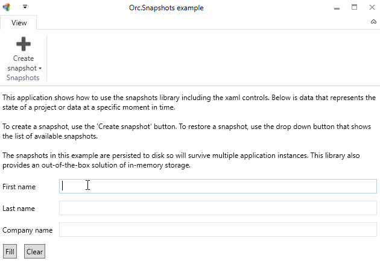

# Orc.Snapshots

Manage snapshots the easy way using this library.

# Quick introduction

Snapshots are like save games. They represent a set of data and/or values from a specific moment in time in an application. Using snapshots allows an application (and thus eventually the end-user) to store data (in memory, in a file or any in other persistence tech) which can later be retrieved.

The advantage of using this library is that it will zip all the data into a single snapshot package. The example below has 3 different providers (they are just examples, it doesn't have to make sense what they are doing):

* ProjectSnapshotProvider => stores the data in a project to a snapshot
* DateTimeSnapshotProvider => stores the current date/time to a snapshot
* UsernameSnapshotProvider => stores the current username to a snapshot

Whenever a snapshot is created, the `SnapshotManager` will:

1. Create a zip memory stream
2. For each provider, it will ask the provider to fill up a memory stream which is stored as a separate file
3. Persist the snapshot memory stream to the required persistence store

This will result in the following zip archive:

- Snapshot.zip
	- ProjectSnapshotProvider.zip => contains the zipped memory stream of the snapshot provider
	- DateTimeSnapshotProvider.zip => contains the zipped date/time
	- UsernameSnapshotProvider.zip => contains the zipped username

If the data inside the snapshots needs to be encrypted, it can easily be achieved by implementing a custom `ISnapshotStorageService` and encrypt the data stream before writing to disk.

Below is an overview of the most important components:

- **ISnapshot** => the actual snapshot object
- **ISnapshotManager** => the snapshot manager with events and management methods
- **ISnapshotProvider** => custom providers that will provide / restore snapshots

Working with snapshot always requires multiple method calls:

1. Create a snapshot
2. Add the snapshot to the manager
3. Save the snapshots

*Separate methods were introduced to allow full customized usage of the interaction with the snapshots. There are convenient extension methods that merge multiple method calls into a single call.*

-- 
 
**Important note** 

The base directory will be used as repository. This means that it cannot contain other files and all other files will be deleted from the directory

-- 

# Initializing the snapshot manager

Because the snapshot manager is using async, the initialization is a separate method. This gives the developer the option to load the snapshots whenever it is required. To load the stored snapshots from disk, use the code below:

	await snapshotManager.LoadAsync(); 

# Retrieving a list of all snapshots

    var snapshots = snapshotManager.Snapshots;

# Creating a snapshot

Storing information in a snapshot is the responsibility of every single component in the application. The *ISnapshotManager* will gather all the information for the snapshot providers.

Call the following method to create a snapshot.

    await snapshotManager.CreateSnapshotAsync("My snapshot title");

**Note that a snapshot is only created, not registered in the manager or saved to disk by this method**.

## Providers

Create a provider as shown in the example below:

**// TODO: write an example provider**

Register the provider in the manager for it to take effect:

	snapshotManager.AddProvider(myProvider);

# Registering a snapshot and saving all snapshots to disk

To register a snapshot with the manager, use the code below:

	await snapshotManager.AddAsync(snapshot);

To save all snapshots, use the code below:

    snapshotManager.SaveAsync();